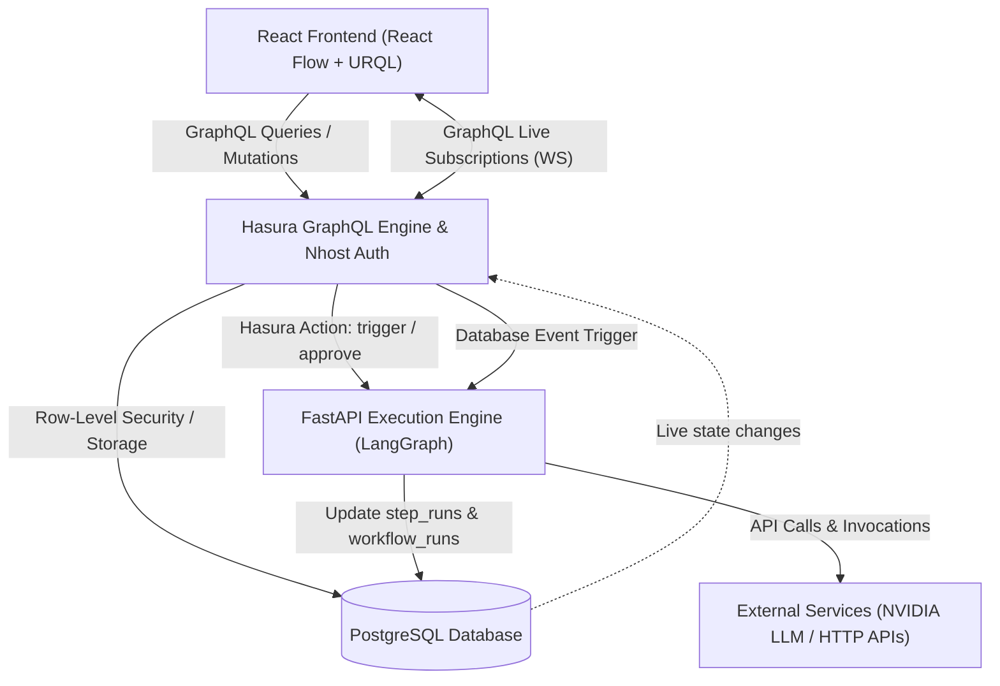

# Fluxo — AI Agent Workflow Builder

A mini n8n for chaining AI agent steps, built with nhost, Hasura, LangGraph, and React.

[](https://react.dev/)
[](https://www.typescriptlang.org/)
[](https://fastapi.tiangolo.com/)
[](https://www.python.org/)
[](https://hasura.io/)
[](https://www.postgresql.org/)
[](https://langchain-ai.github.io/langgraph/)
[](https://vercel.com/)
[](https://render.com/)

---

## Live Demo

- **Live Application**: [https://fluxo-wine-delta.vercel.app](https://fluxo-wine-delta.vercel.app)
- **Backend Health Check**: [https://fluxo-fcoz.onrender.com/health](https://fluxo-fcoz.onrender.com/health)

> [!NOTE]
> Demo credentials are in the Testing section below.

---

## Overview

Fluxo is a full-stack, visual AI workflow builder designed for chaining complex, multi-step agent actions. Users can compose graphical pipelines of LLM calls, HTTP requests, database writes, branch conditions, and human approval gates inside an interactive canvas interface.

The platform is fortified by a strict, two-layer permission architecture: Layer 1 enforces multi-tenant organization scoping and role-based access control (Owner, Editor, Viewer) via Hasura GraphQL row-level permissions, while Layer 2 enforces step-level validation and trigger authorization within the execution engine.

At its core, Fluxo solves the challenge of stateful, resumable agent orchestration. By leveraging LangGraph, external LLM and API interactions execute through a checkpointed graph that can safely interrupt execution at Human-in-the-Loop approval gates and resume seamlessly once authorized.

---

## Architecture

The system is decoupled into three primary tiers:
1. **Data, Auth & Realtime Tier**: Hosted nhost stack providing PostgreSQL, Nhost Auth (JWT authentication), and Hasura GraphQL engine with live WebSocket subscriptions.
2. **Execution Engine**: A FastAPI Python service embedding LangGraph state machines, invoked synchronously by Hasura Actions (`triggerWorkflowRun` and `approveStep`) and Event Triggers.
3. **Frontend Client**: A React 18 SPA built with TypeScript, React Flow for visual workflow graphs, Tailwind CSS for dark-mode styling, and URQL for GraphQL queries, mutations, and live subscriptions.



---

## Tech Stack

| Layer | Technology |
|---|---|
| **Frontend** | React 18, TypeScript, Vite, React Flow (@xyflow/react), Tailwind CSS |
| **Backend** | Python 3.11+, FastAPI, LangGraph, Uvicorn, HTTPX |
| **Database** | PostgreSQL 16 |
| **Auth** | Nhost Auth (JWT bearer tokens, session management) |
| **Realtime** | Hasura GraphQL WebSocket Subscriptions (graphql-ws) |
| **Deployment (Frontend)** | Vercel |
| **Deployment (Backend)** | Render |
| **LLM Provider** | NVIDIA NIM API (Llama 3.1 8B Instruct / configurable per-step) |

---

## Features

- **6 Modular Step Types**:
  - `llm_call`: Execute generative AI prompts with automatic retry logic and step-output templating.
  - `http_request`: Send external HTTP requests (GET, POST, PUT, DELETE) with custom headers and JSON payloads.
  - `db_write`: Insert data rows directly into database tables with validation.
  - `notify`: Notification step for logging and alerting workflow progress.
  - `conditional_branch`: Evaluate upstream step outputs with comparison operators (`eq`, `contains`) to route execution.
  - `approval_gate`: Human-in-the-loop checkpoint that pauses workflow execution until an authorized user approves or rejects.
- **4 Trigger Types**:
  - `manual`: Direct user execution via the canvas top bar.
  - `webhook`: Inbound webhook endpoint with payload extraction.
  - `scheduled`: Time-based execution via cron / periodic intervals.
  - `database_event`: React to database insertions via Hasura Event Triggers.
- **Two-Layer Permission System**:
  - *Layer 1 (Hasura RLS)*: Multi-tenant tenant isolation ensuring users only access workflows within their organization and role.
  - *Layer 2 (Backend Execution)*: Enforces trigger authorization and human approval permissions.
- **Live Execution Streaming**: Real-time step progress, output previews, and running activity log feeds delivered via GraphQL subscriptions.
- **Human Approval Gates with Pause/Resume**: Non-blocking LangGraph graph interruption with interactive floating approval banner.
- **Per-Step LLM Provider Override**: Optional custom API base URL and API key configuration per individual LLM step.
- **Usage Quota Tracking**: Real-time tracking and enforcement of organization monthly call limits.

---

## Local Development Setup

1. **Clone the repository**:
   ```bash
   git clone https://github.com/Princ3mish/Fluxo.git
   cd Fluxo
   ```

2. **Set up Nhost Cloud Project**:
   Create a project on [nhost.io](https://nhost.io). (Note: Nhost CLI has no native Windows support; a hosted cloud project is used).

3. **Configure Environment Variables**:
   - Copy `backend/.env.example` to `backend/.env` and supply `HASURA_GRAPHQL_ENDPOINT`, `HASURA_ADMIN_SECRET`, `LLM_API_KEY`, and `LLM_API_BASE_URL`.
   - Copy `frontend/.env.example` to `frontend/.env` and supply `VITE_NHOST_SUBDOMAIN`, `VITE_NHOST_REGION`, and `VITE_HASURA_GRAPHQL_ENDPOINT`.

4. **Install Backend Dependencies**:
   ```bash
   cd backend
   pip install uv && uv sync
   ```

5. **Install Frontend Dependencies**:
   ```bash
   cd ../frontend
   npm install
   ```

6. **Run Backend Service**:
   ```bash
   cd backend
   uv run uvicorn app.main:app --reload --port 8000
   ```

7. **Run Frontend Development Server**:
   ```bash
   cd frontend
   npm run dev
   ```

8. **Apply Hasura Migrations & Metadata**:
   Point your Hasura CLI or migration tool to your hosted project:
   ```bash
   cd hasura
   hasura migrate apply --endpoint <YOUR_HASURA_ENDPOINT> --admin-secret <YOUR_ADMIN_SECRET>
   hasura metadata apply --endpoint <YOUR_HASURA_ENDPOINT> --admin-secret <YOUR_ADMIN_SECRET>
   ```

9. **Expose Local Backend for Hasura Actions**:
   Hasura Actions require a publicly reachable backend URL. Start an HTTPS tunnel (e.g. ngrok) and update the action handler URLs in Hasura:
   ```bash
   ngrok http 8000
   ```

---

## Testing / Demo Credentials

The following seeded test accounts are configured across two isolated organizations:

| Email | Password | Organization | Role |
|---|---|---|---|
| `orga-owner@test.com` | `TestPass123!` | Org A | Owner |
| `orga-editor@test.com` | `TestPass123!` | Org A | Editor |
| `orga-viewer@test.com` | `TestPass123!` | Org A | Viewer |
| `orgb-owner@test.com` | `TestPass123!` | Org B | Owner |
| `orgb-editor@test.com` | `TestPass123!` | Org B | Editor |
| `orgb-viewer@test.com` | `TestPass123!` | Org B | Viewer |

> [!IMPORTANT]
> These are seed accounts for evaluation purposes only.

---

## Project Structure

```text
Fluxo/
├── frontend/             # React 18 SPA, React Flow canvas, URQL client & components
├── backend/              # FastAPI application, LangGraph engine, Actions & event handlers
├── hasura/               # Hasura metadata, schema migrations, and permission definitions
└── graphql-operations/   # GraphQL documents for queries, mutations, and live subscriptions
```

---

## Known Limitations

- **In-Memory Checkpointer**: LangGraph currently utilizes an in-memory checkpointer (`MemorySaver`) for paused-run states. A backend process restart will lose in-flight paused executions; a production deployment would swap this with `PostgresSaver` for persistent state durability.
- **Notify Step Scope**: The `notify` step type currently logs output directly to the server console rather than triggering an external notification dispatch system.
- **Scheduled Trigger Dispatching**: Scheduled triggers require an external cron dispatcher (such as cron-job.org or cloud scheduler) to invoke `/internal/run-scheduled-check` periodically.
